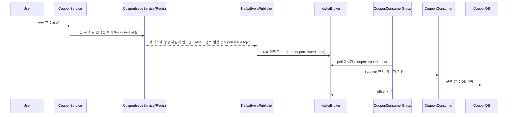
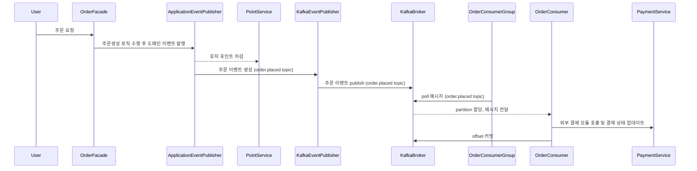

# 카프카를 이용한 대용량 트래픽 프로세스 설계 문서

## 1. 배경
현 서비스에서는 Redis를 활용해 선착순 쿠폰 발급, 주문과 주문취소를 Redis(Redisson) 기반 분산락과 캐시를 사용하고 있습니다.
이는 빠른 응답성을 가지며 트래픽이 많지 않을 때 효과적입니다. 하지만 대규모 트래픽 상황에서는 Redis 단일노드에 과도한 부하가 집중되고
락 충돌, 메모리 한계, 처리 속도 병목이 발생할 수 있습니다.
따라서 Kafka 기반의 비동기 메시징 프로세스로 전환하여 확장성과 안정성을 확보하려 합니다.

## 2. 문제 정의
기존 Redis 기반 프로세스의 한계:

- 단일 병목: Redis가 단일 노드이거나 마스터/슬레이브 구조일 경우, 락 획득·해제 및 메모리 읽기/쓰기 병목 발생.
- 메모리 한계: 모든 상태(재고, 발급 유저, 요청 큐)를 Redis 메모리에 유지 → 대량 동접 시 메모리 초과 위험.
- 락 충돌 빈도: Redisson의 분산 락은 결국 SETNX 기반으로, 다수의 동시 경쟁에서 충돌 및 대기 증가.
- 순차성·중복 처리의 한계: 클라이언트 측에서 여러 번 요청이 들어오면 락으로만 제어해야 하며, 실시간 중복 제거나 순서 보장은 힘듦.
- 복구 난이도: 장애 시 Redis 상태 복구는 어렵고, 롤백 및 보정이 필요함.

## 3. 문제 해결 전략
Kafka 기반으로 개선할 전략:

1. 비동기화(Asynchronous):
   - 클라이언트 요청을 Kafka 토픽에 먼저 적재하기 때문에 클라이언트에 빠른 응답 제공.
   - 백엔드에서 Kafka Consumer가 비동기로 처리.
   - 클라이언트는 요청 완료 응답만 받고 상세 처리 결과는 별도 알림 or 폴링으로 확인.
2. 병렬성(Parallelism):
   - Kafka 파티션을 이용해 이벤트를 병렬로 처리 가능. 
   - 쿠폰 ID, 주문 ID 기준 파티셔닝으로 특정 키별 메시지 순서 보장과 함께 병렬 처리 극대화.
3. 순차성(Sequentiality):
   - 특정 쿠폰 ID에 대한 이벤트는 같은 파티션으로 라우팅 → 순서 보장.
   - Kafka는 파티션 내 메시지 순서를 보장하므로 선착순 처리에 적합.
4. 중복 처리(Deduplication): 
   - Consumer 측에서 idempotent(멱등) 로직 적용.
     - Kafka 메시지의 unique Key를 레디스에 저장해 중복이벤트인지 확인하는 AOP로직 추가
5. 장애 복구 및 확장성:
   - Kafka는 메시지를 디스크에 내구성 있게 저장.
   - 장애 시 재처리 가능, Redis보다 안정적.
   - Consumer 수평 확장이 용이.

## 4. 비지니스 시퀀스 다이어그램
### 1) 선착순 쿠폰 발급

1. 사용자가 API 서버에 쿠폰 발급을 요청
2. CouponIssueService에서 Redis를 사용하여 쿠폰 재고 수량 감소 및 유저 발급 여부 확인 후 Redis에 결과 저장
3. Redis에서 성공적으로 처리 되었을 때만 Kafka Event 발행 (coupon.issued)
4. Kafka Consumer는 userId,couponId를 받아 UserCoupon를 save하고 해당 쿠폰의 재고 감소 (DB insert/update)

### 2) 상품 주문 

1. 사용자가 API 서버에 상품 주문 요청
2. OrderFacade에서 사용 쿠폰과 Product를 조회해 Order 객체 create
3. OrderFacade에서 Order 객체를 성공적으로 만들었다면 ApplicationEventPublisher 발행.
4. ApplicationEventPublisher에서 PointService로 해당 유저 잔액을 차감 후 Kafka Event 발행 (order.placed)
5. Kafka Consumer는 orderId,userId 등의 정보를 받아 PaymentClient(외부 데이터 플랫폼)로 결제 요청 및 결제 상태 업데이트

## 5. 카프카 구성 및 프로세스 진행 과정 
| 구성 요소                | 역할                                                                         |
| -------------------- |----------------------------------------------------------------------------|
| Kafka Topic          | `coupon.issued`, `order.placed`, `order.canceled`                          |
| Kafka Producer       | 서비스 레이어에서 사용자 요청을 Kafka에 발행                                                |
| Kafka Consumer Group | 쿠폰, 주문 처리용 컨슈머 그룹 (각 토픽별 멀티 컨슈머)                                           |
| Partition Key        | `requestId(client에서 보내주는 UUID)` or `couponId` or `orderId` → 순서 보장 및 병렬 처리 |
| Processor            | 실제 재고 차감, 주문 처리, 상태 기록 로직 실행                                               |
| DB                   | 최종 상태 영속화                                                                  |
| Cache (Redis)        | 읽기 최적화용 캐시 업데이트                                                            |

✅ 프로세스 상세:
- Kafka Producer는 요청 발생 시 메시지 발행.
- Kafka Broker는 파티셔닝으로 메시지 분배.
- Consumer는 파티션별로 병렬 처리, idempotent 설계.
- 재고, 쿠폰 상태는 DB 기준으로 관리, Redis는 조회용 캐시.
- Consumer 장애 시 오프셋 기준 재처리 가능.

## 6. 결론 
Kafka 기반으로 전환함으로써:
- 기존 Redis 락 기반 동시성 처리의 병목을 제거.
- 선착순 쿠폰 발급 및 주문 처리의 순서 보장, 병렬성, 중복 처리 개선.
- 장애 복구, 로그 추적, 메시지 내구성 강화.
- 트래픽 증가 시 Consumer를 수평 확장해 처리량 확보 가능.

기존 Redis 방식은 단순하고 빠르지만, 대규모 트래픽에서 안정성이 떨어졌고, 운영 복잡성(락 충돌, 메모리 이슈)이 존재했습니다. Kafka는 메시징 중심 아키텍처로 설계함으로써 각 요청을 분리·비동기화하고, 처리 병목을 풀어주며, 서비스 신뢰성과 확장성을 크게 향상시킬 수 있습니다.

