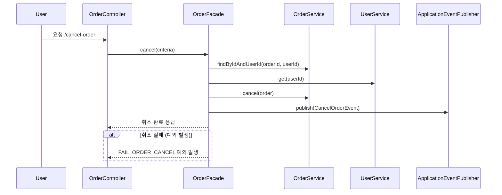
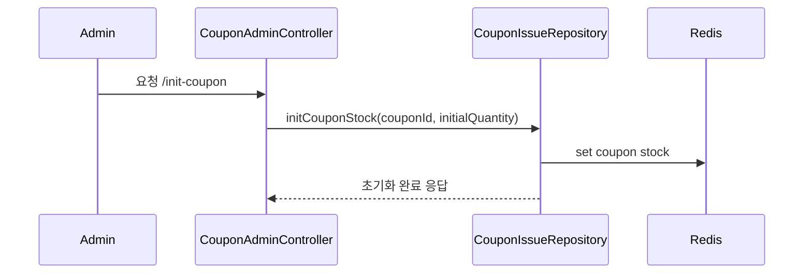

# 카프카를 이용한 대용량 트래픽 프로세스 설계 문서

## 1. 배경
현 서비스에서는 Redis를 활용해 선착순 쿠폰 발급, 주문과 주문취소를 Redis(Redisson) 기반 분산락과 캐시를 사용하고 있습니다.
이는 빠른 응답성을 가지며 트래픽이 많지 않을 때 효과적입니다. 하지만 대규모 트래픽 상황에서는 Redis 단일노드에 과도한 부하가 집중되고
락 충돌, 메모리 한계, 처리 속도 병목이 발생할 수 있습니다.
따라서 Kafka 기반의 비동기 메시징 프로세스로 전환하여 확장성과 안정성을 확보하려 합니다.

## 2. 문제 정의
기존 Redis 기반 프로세스의 한계:

- 단일 병목: Redis가 단일 노드이거나 마스터/슬레이브 구조일 경우, 락 획득·해제 및 메모리 읽기/쓰기 병목 발생.

- 메모리 한계: 모든 상태(재고, 발급 유저, 요청 큐)를 Redis 메모리에 유지 → 대량 동접 시 메모리 초과 위험.

- 락 충돌 빈도: Redisson의 분산 락은 결국 SETNX 기반으로, 다수의 동시 경쟁에서 충돌 및 대기 증가.

- 순차성·중복 처리의 한계: 클라이언트 측에서 여러 번 요청이 들어오면 락으로만 제어해야 하며, 실시간 중복 제거나 순서 보장은 힘듦.

- 복구 난이도: 장애 시 Redis 상태 복구는 어렵고, 롤백 및 보정이 필요함.

## 3. 문제 해결 전략
Kafka 기반으로 개선할 전략:

1. 비동기화(Asynchronous):
   - 클라이언트 요청을 Kafka 토픽에 먼저 적재.
   - 백엔드에서 Kafka Consumer가 비동기로 처리.
   - 클라이언트는 요청 완료 응답만 받고 상세 처리 결과는 별도 알림 or 폴링.

2. 병렬성(Parallelism):

   - Kafka 파티션을 이용해 이벤트를 병렬로 처리. 
   - 예: 쿠폰 ID별 파티셔닝 → 쿠폰별 소비자 그룹 멀티 스레드 처리.

3. 순차성(Sequentiality):

   - 특정 쿠폰 ID에 대한 이벤트는 같은 파티션으로 라우팅 → 순서 보장.
   - Kafka는 파티션 내 메시지 순서를 보장하므로 선착순 처리에 적합.

4. 중복 처리(Deduplication):
   - Kafka 메시지 키를 couponId:userId로 설정 → 동일 유저 요청 중복 방지.
   - Consumer 측에서 idempotent(멱등) 로직 적용.

5. 장애 복구 및 확장성:
   - Kafka는 메시지를 디스크에 내구성 있게 저장.
   - 장애 시 재처리 가능, Redis보다 안정적.
   - Consumer 수평 확장이 용이.
## 4. 비지니스 시퀀스 다이어그램
```
사용자 → API Gateway → Coupon/Order Service → Kafka → Coupon/Order Processor (Consumer) → DB & Cache

```
```mermaid
sequenceDiagram
    participant User
    participant CouponController
    participant KafkaProducer (CouponTopic)
    participant KafkaBroker
    participant KafkaConsumer (CouponService)
    participant CouponDatabase

    User ->> CouponController: 요청 /issue-coupon
    CouponController ->> KafkaProducer: send(CouponIssueCommand)
    KafkaProducer ->> KafkaBroker: publish to coupon-issue-topic
    KafkaConsumer ->> KafkaBroker: subscribe coupon-issue-topic
    KafkaConsumer ->> CouponDatabase: 처리 (재고 차감, 발급 기록)
    KafkaConsumer -->> KafkaProducer: 발급 성공/실패 이벤트 publish
sequenceDiagram
    participant User
    participant OrderController
    participant KafkaProducer (OrderTopic)
    participant KafkaBroker
    participant KafkaConsumer (OrderService)
    participant OrderDatabase
    participant KafkaProducer (PaymentTopic)
    participant KafkaConsumer (PaymentService)

    User ->> OrderController: 요청 /place-order
    OrderController ->> KafkaProducer: send(OrderPlaceCommand)
    KafkaProducer ->> KafkaBroker: publish to order-topic
    KafkaConsumer (OrderService) ->> KafkaBroker: subscribe order-topic
    KafkaConsumer (OrderService) ->> OrderDatabase: 주문 생성, 재고 차감, 쿠폰 사용
    KafkaConsumer (OrderService) ->> KafkaProducer (PaymentTopic): send(PaymentRequestEvent)
    KafkaProducer (PaymentTopic) ->> KafkaBroker: publish to payment-topic
    KafkaConsumer (PaymentService) ->> KafkaBroker: subscribe payment-topic
    KafkaConsumer (PaymentService) ->> PaymentGateway: 결제 처리
    KafkaConsumer (PaymentService) ->> OrderDatabase: 결제 상태 업데이트

```
설명:
✅ KafkaProducer는 Controller 계층에서 명령 메시지를 전송.
✅ KafkaConsumer는 백그라운드에서 메시지를 구독하고 처리.
✅ 주문-결제 연계는 이벤트 체인으로 연결됨 (주문 성공 → 결제 요청 이벤트 → 결제 성공 → 주문 완료 상태).

### 주문 취소

### 쿠폰 초기화 플로우


정리
✅ 주문 취소:
사용자 요청 → 주문 조회 → 주문 상태 변경 → 이벤트 발행 → 완료/실패 응답.

✅ 쿠폰 초기화:
관리자 요청 → Redis 재고 초기화 → 완료 응답.
## 5. 카프카 구성 및 프로세스 진행 과정 
| 구성 요소                | 역할                                             |
| -------------------- | ---------------------------------------------- |
| Kafka Topic          | `coupon-issue`, `order-create`, `order-cancel` |
| Kafka Producer       | 서비스 레이어에서 사용자 요청을 Kafka에 발행                    |
| Kafka Consumer Group | 쿠폰, 주문 처리용 컨슈머 그룹 (각 토픽별 멀티 컨슈머)               |
| Partition Key        | `couponId` or `orderId` → 순서 보장 및 병렬 처리        |
| Processor            | 실제 재고 차감, 주문 처리, 상태 기록 로직 실행                   |
| DB                   | 최종 상태 영속화                                      |
| Cache (Redis)        | 읽기 최적화용 캐시 업데이트                                |

✅ 프로세스 상세:
- Kafka Producer는 요청 발생 시 메시지 발행.
- Kafka Broker는 파티셔닝으로 메시지 분배.
- Consumer는 파티션별로 병렬 처리, idempotent 설계.
- 재고, 쿠폰 상태는 DB 기준으로 관리, Redis는 조회용 캐시.
- Consumer 장애 시 오프셋 기준 재처리 가능.

## 6. 결론 
Kafka 기반으로 전환함으로써:
- 기존 Redis 락 기반 동시성 처리의 병목을 제거.
- 선착순 쿠폰 발급 및 주문 처리의 순서 보장, 병렬성, 중복 처리 개선.
- 장애 복구, 로그 추적, 메시지 내구성 강화.
- 트래픽 증가 시 Consumer를 수평 확장해 처리량 확보 가능.

기존 Redis 방식은 단순하고 빠르지만, 대규모 트래픽에서 안정성이 떨어졌고, 운영 복잡성(락 충돌, 메모리 이슈)이 존재했습니다. Kafka는 메시징 중심 아키텍처로 설계함으로써 각 요청을 분리·비동기화하고, 처리 병목을 풀어주며, 서비스 신뢰성과 확장성을 크게 향상시킬 수 있습니다.

